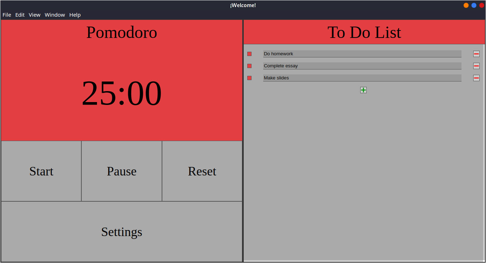
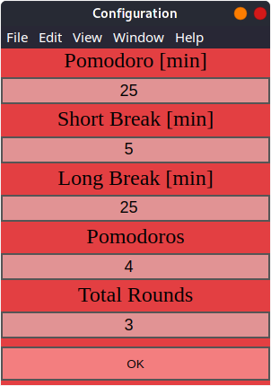

image:https://github.com/afmorenosa/MyPomodoro/workflows/MyPomodoro/badge.svg[]

MyPomodoro
==========

A simple application for managing time in tasks.

== Installation

For instillation you can download the installer for you respective operative
system.

=== Windows

https://github.com/afmorenosa/MyPomodoro/releases/download/1.0.0/mypomodoro.Setup.1.0.0.exe

=== Linux

==== .deb file

https://github.com/afmorenosa/MyPomodoro/releases/download/1.0.0/mypomodoro_1.0.0_amd64.deb

==== .mpn

https://github.com/afmorenosa/MyPomodoro/releases/download/1.0.0/mypomodoro-1.0.0.x86_64.rpm

==== Arch

https://github.com/afmorenosa/MyPomodoro/releases/download/1.0.0/mypomodoro-1.0.0.pacman

== Colors code in the ToDo list

[red]#icon:square[]# ToDo

[blue]#icon:square[]# Doing

[green]#icon:square[]# Done

== Screenshots

